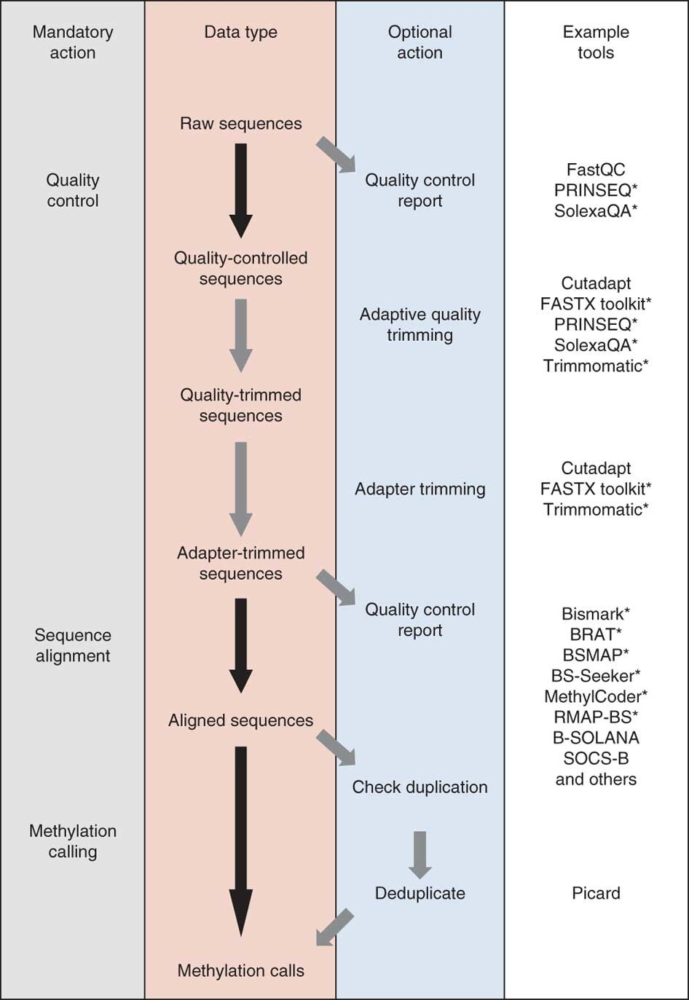

# DNA甲基化

## 背景知识

DNA甲基化(DNAmethylation)在基因表达调控方面发挥重要作用，并与转座子和其他重复原件的沉默有关。

异常的DNA甲基化和包括癌症在内的多种疾病有关。

DNA甲基化是发生在DNA序列上的化学修饰——在DNA甲基转移酶(DNMT)的催化下，胞嘧啶的第5个碳原子被添加一个甲基形成5mC。5mC可以被**Tet蛋白**进一步氧化成5hmC(羟甲基化)。通常所说的DNA甲基化是指的5mC和5hmC。

目前常用的检测DNA甲基化的技术一般有**MeDIP-Seq，MBD-Seq，BS-Seq**等，其中BS-Seq可以在单碱基水平上检测DNA甲基化状态，而其他几个只能测得某个区域的甲基化状态。DNA经过亚硫酸氢钠处理后会把非甲基化的胞嘧啶转化为尿嘧啶，但是甲基化的胞嘧啶没有变化。所以经过PCR扩增之后非甲基化的胞嘧啶变为胸腺嘧啶，甲基化的胞嘧啶保持不变。

WGBS数据是精确到每个位点的深度测序，数据量因此也很大，动辄就上百个G，但是分析起来却很有意思。有了各种genomic features就可以探索很多事。

## 数据分析流程

这里选取2012发表在Nature Methods杂志是一篇综述文章：[DNA methylome analysis using short bisulfite sequencing data](http://www.nature.com/nmeth/journal/v9/n2/full/nmeth.1828.html) 总结的数据分析流程，如下：



## 示例数据来源

这里随便挑选UCSD Human Reference Epigenome Mapping Project中的一个样本[GSM429321](https://www.ncbi.nlm.nih.gov/geo/query/acc.cgi?acc=GSM429321)，是Whole genome shotgun bisulfite sequencing of the H1 cell line，包含了Runs: 43 runs, 570.4M spots, 49.6G bases, [32.3Gb](https://www.ncbi.nlm.nih.gov/Traces/study?acc=SRX006239)  ， 这里的数据量比较大，就不做演示了。

主要还是下载数据，数据质量控制，比对，只不过这个流程的**比对工具比较特殊**，这里使用bismark工具，该工具需要构建参考基因组，然后才能将数据比对到基因组上，本例中使用hg19参考基因。

参考基因组下载地址：http://hgdownload.soe.ucsc.edu/goldenPath/hg19/chromosomes/

## bismark原理

这些教程写的不好，https://hwoihann.github.io/farnorth/analysis/2017/03/25/WGBS-analysis-summary.html 

### 使用bismark构建参考基因组：

```
bismark_genome_preparation --path_to_bowtie /bowtie2-2.0.5 -verbose out/
 out/       为chr19.fa.gz所在目录并且输出结果到该目录。
 -verbose        输出更详细的结果和错误调试信息。
--path_to_bowtie   bowtie的安装目录，如果不加该参数，稍后会有提示。 
```

### 用bismark将reads比对到构建的参考基因组上

```
bismark Y/ --path_to_bowtie …/bowtie2-2.0.5--bowtie2 test.fastq -o align_result
 --bowtie2/ --bowtie1  为--bowtie2/--bowtie1建立亚硫酸盐索引
test.fastq            要比对到参考基因组上的reads文件。
-o                  在align_result文件夹中输出结果文件test_bismark_bt2.bam。
```

### 根据比对结果test_bismark_bt2.bam计算甲基化水平

```
bismark_methylation_extractor-s -comprehensive --bedGraph --counts align_result/test_bismark_bt2.bam -o output_file/
-s/--single-end 指定数据为单端测序
-p/--paired-end 指定数据为双端测序
--comprehensive 添加该参数将把4个可能的链特异甲基化信息加入输出文件中。
--bedGraph –counts 生成bedGraph文件，可以用来得到全基因组范围的胞嘧啶报告。
```

