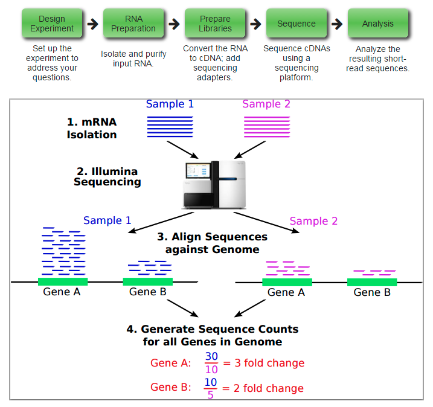
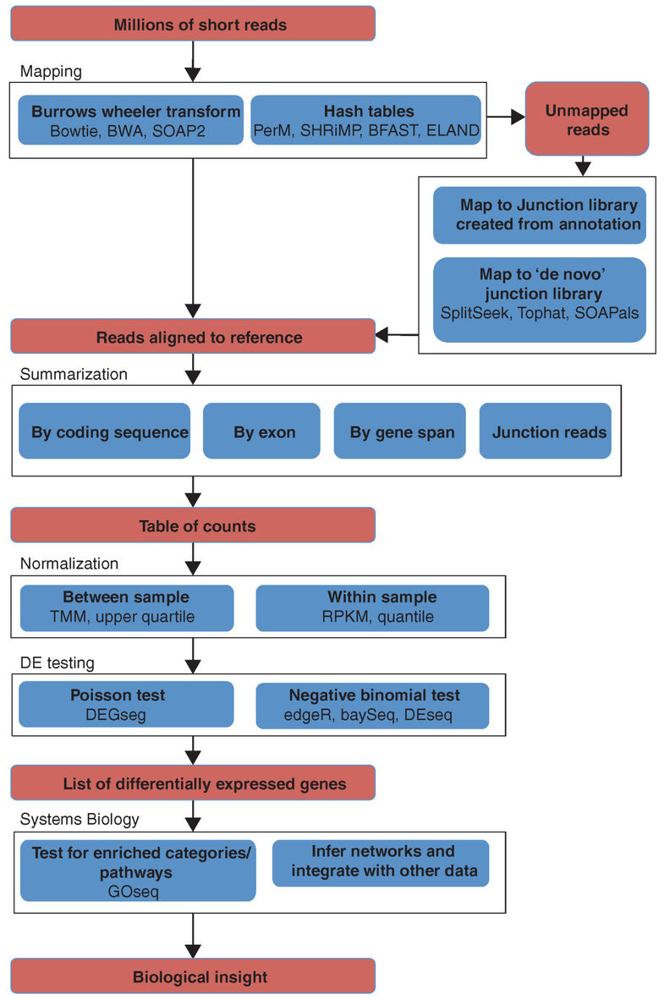

## 转录组

转录组测序的研究对象为特定细胞在某一功能状态下所能转录出来的**所有 RNA 的总和**，包括 mRNA 和非编码 RNA 。通过转录组测序，能够全面获得物种特定组织或器官的转录本信息，从而进行转录本结构研究、变异研究、**基因表达水平研究**以及全新转录本发现等研究。

其中，基因表达水平的探究是转录组领域**最热门**的方向，利用转录组数据来识别转录本和表达定量，是转录组数据的核心作用。由于这个作用，他可以不依赖其他组学信息，单独成为一个产品项目RNA-seq测序。所以很多时候**转录组测序**会与**RNA-seq**混为一谈。

现在RNA-seq数据**使用广泛**，但是没有一套流程可以解决所有的问题。比较值得关注的RNA-seq分析中的重要的步骤包括：**实验设计，质控，read比对，表达定量，可视化，差异表达，识别可变剪切，功能注释，融合基因检测，eQTL定位**等。

## 流程介绍



来自于R处理[mRNA-seq数据](http://biocluster.ucr.edu/~rkaundal/workshops/R_mar2016/RNAseq.html)



来自于2010发表在Genome Biology的[From RNA-seq reads to differential expression results](https://genomebiology.biomedcentral.com/articles/10.1186/gb-2010-11-12-220)文章配图

## 数据来源文章

数据来自于发表在Nature commmunication 上的一篇文章 “Temporal dynamics of gene expression and histone marks at the Arabidopsis shoot meristem during flowerin”。原文用RNA-Seq的方式研究在开花阶段,芽分生组织在**不同时期的基因表达变化。**

原文的流程是： TopHat -> SummarizeOverlaps -> Deseq2 -> AmiGO 
其中比对的参考基因组为TAIR10 ver.24 ，并且屏蔽了ribosomal RNA  regions (2:3471–9557; 3:14,197,350–14,203,988)。

Deseq2只计算至少在一个时间段的FPKM的count > 1 的基因。

数据存放在<http://www.ebi.ac.uk/arrayexpress/>, ID为E-MTAB-5130。

实验设计： 4个时间段（0,1,2,3），分别有4个生物学重复，一共有16个样品。

## 数据下载

```Shell
conda install -c bioconda salmon 

wget http://www.ebi.ac.uk/arrayexpress/files/E-MTAB-5130/E-MTAB-5130.sdrf.txt
head -n1 E-MTAB-5130.sdrf.txt | tr '\t' '\n' | nl | grep URI
tail -n +2 E-MTAB-5130.sdrf.txt | cut -f 33 | xargs -i wget {}


nohup wget ftp://ftp.ensemblgenomes.org/pub/plants/release-28/fasta/arabidopsis_thaliana/cdna/Arabidopsis_thaliana.TAIR10.28.cdna.all.fa.gz &

nohup wget ftp://ftp.ensemblgenomes.org/pub/plants/release-28/fasta/arabidopsis_thaliana/dna/Arabidopsis_thaliana.TAIR10.28.dna.genome.fa.gz &
nohup wget  ftp://ftp.ensemblgenomes.org/pub/plants/release-28/gff3/arabidopsis_thaliana/Arabidopsis_thaliana.TAIR10.28.gff3.gz &
nohup wget ftp://ftp.ensemblgenomes.org/pub/plants/release-28/gtf/arabidopsis_thaliana/Arabidopsis_thaliana.TAIR10.28.gtf.gz &

```

## salmon 流程

软件介绍：ome of the upstream quantification methods **(*Salmon*, *Sailfish*, *kallisto*)** are substantially faster and require less memory and disk usage compared to alignment-based methods that require creation and storage of BAM files

软件官网：https://combine-lab.github.io/salmon/

先用用Salmon建立索引：

- salmon index -t  Arabidopsis_thaliana.TAIR10.28.cdna.all.fa.gz  -i athal_index

建立索引耗时53秒，生成的索引文件夹如下：

```
[jianmingzeng@jade salmon]$ ls -lh
total 19M
-rw-rw-r-- 1 jianmingzeng jianmingzeng  19M Oct 17 11:18 Arabidopsis_thaliana.TAIR10.28.cdna.all.fa.gz
drwxrwxr-x 2 jianmingzeng jianmingzeng 4.0K Oct 17 11:54 athal_index
-rw-rw-r-- 1 jianmingzeng jianmingzeng  142 Oct 17 11:20 wget_cdna.sh
[jianmingzeng@jade salmon]$ ls -lh  athal_index/
total 1.1G
-rw-rw-r-- 1 jianmingzeng jianmingzeng 751M Oct 17 11:54 hash.bin
-rw-rw-r-- 1 jianmingzeng jianmingzeng  357 Oct 17 11:54 header.json
-rw-rw-r-- 1 jianmingzeng jianmingzeng  115 Oct 17 11:54 indexing.log
-rw-rw-r-- 1 jianmingzeng jianmingzeng  156 Oct 17 11:54 quasi_index.log
-rw-rw-r-- 1 jianmingzeng jianmingzeng   89 Oct 17 11:54 refInfo.json
-rw-rw-r-- 1 jianmingzeng jianmingzeng 7.8M Oct 17 11:53 rsd.bin
-rw-rw-r-- 1 jianmingzeng jianmingzeng 248M Oct 17 11:54 sa.bin
-rw-rw-r-- 1 jianmingzeng jianmingzeng  63M Oct 17 11:53 txpInfo.bin
-rw-rw-r-- 1 jianmingzeng jianmingzeng   96 Oct 17 11:54 versionInfo.json
[jianmingzeng@jade salmon]$
```


然后对所有数据定量

由于样本一共有16个，不可能一条条输入命令，所以我们写一个脚本：

```shell
#! /bin/bash
index=salmon/athal_index ## 指定索引文件夹
for fn in ERR1698{194..209};
do
    sample=`basename ${fn}`
    echo "Processin sample ${sampe}"
    salmon quant -i $index -l A \
        -1 ${sample}_1.fastq.gz \
        -2 ${sample}_2.fastq.gz \
        -p 5 -o quants/${sample}_quant
done
```


## subread流程

也是首先构建索引，但是这个需要提前解压fa文件

```
gunzip Arabidopsis_thaliana.TAIR10.28.dna.genome.fa.gz
~/biosoft/featureCounts/subread-1.5.3-Linux-x86_64/bin/subread-buildindex -o athal_index   Arabidopsis_thaliana.TAIR10.28.dna.genome.fa 
```

消耗时间也不到一分钟，生成的索引文件如下：

```
117M Oct 17 11:21 Arabidopsis_thaliana.TAIR10.28.dna.genome.fa
 15M Oct 17 11:41 Arabidopsis_thaliana.TAIR10.28.gff3.gz
 29M Oct 17 12:19 athal_index.00.b.array
231M Oct 17 12:19 athal_index.00.b.tab
 314 Oct 17 12:19 athal_index.files
345K Oct 17 12:18 athal_index.log
```

然后比对也是一个脚本批量化完成

```shell
#! /bin/bash
subjunc="/home/jianmingzeng/biosoft/featureCounts/subread-1.5.3-Linux-x86_64/bin/subjunc"; 
index='subread/athal_index';
for fn in ERR1698{194..209};
do
    sample=`basename ${fn}`
    echo "Processin sample ${sampe}" 
    $subjunc -i $index \
        -r ${sample}_1.fastq.gz \
        -R ${sample}_2.fastq.gz \
        -T 5 -o ${sample}_subjunc.bam
done
```

但是输出bam还不够，还需要用featureCounts对之进行定量

```shell
gff3='/home/jianmingzeng/data/public/tair/subread/Arabidopsis_thaliana.TAIR10.28.gff3.gz';
gtf='/home/jianmingzeng/data/public/tair/subread/Arabidopsis_thaliana.TAIR10.28.gtf';


featureCounts='/home/jianmingzeng/biosoft/featureCounts/subread-1.5.3-Linux-x86_64/bin/featureCounts';
$featureCounts -T 5 -p -t exon -g gene_name -a $gtf -o  counts.txt   *.bam
nohup $featureCounts -T 5 -p -t exon -g gene_id -a $gtf -o  counts_id.txt   *.bam & 
```

这一步骤是非常快的。

## 比对可以有更多选择

```shell
$hisat -p 5 -x $hisat2_mm10_index -1 $fq1 -2 $fq2 -S $sample.sam 2>$sample.hisat.log
samtools sort -O bam -@ 5  -o ${sample}_hisat.bam $sample.sam

$subjunc -T 5  -i $subjunc_mm10_index -r $fq1  -R $fq2 -o ${sample}_subjunc.bam
## 比对的sam自动转为bam，但是并不按照参考基因组坐标排序

bwa mem -t 5 -M  $bwa_mm10_index $fq1 $fq2 1>$sample.sam 2>/dev/null 
samtools sort -O bam -@ 5  -o ${sample}_bwa.bam $sample.sam

$bowtie -p 5 -x $bowtie2_mm10_index -1 $fq1  -2 $fq2 | samtools sort  -O bam  -@ 5 -o - >${sample}_bowtie.bam

## star软件载入参考基因组非常耗时，约10分钟，也比较耗费内存，但是比对非常快，5M的序列就两分钟即可
$star --runThreadN  5 --genomeDir $star_mm10_index --readFilesCommand zcat --readFilesIn  $fq1 $fq2 --outFileNamePrefix  ${sample}_star 
## --outSAMtype BAM  可以用这个参数设置直接输出排序好的bam文件
samtools sort -O bam -@ 5  -o ${sample}_star.bam ${sample}_starAligned.out.sam
```

## 表达矩阵的normalization方法

统计学原理需要耗费很大功夫才能理解，主要是掌握这些normalization方法如何在R里面实现，还有它们的简单比较。

- **Total count (TC)**: Gene counts are divided by the total number of mapped reads (or library size) associated with their lane and multiplied by the mean total count across all the samples of the dataset.
- **Upper Quartile (UQ)**: Very similar in principle to TC, the total counts are replaced by the upper quartile of counts different from 0 in the computation of the normalization factors.
- **Median (Med)**: Also similar to TC, the total counts are replaced by the median counts different from 0 in the computation of the normalization factors. That is, the median is calculated as the median of gene counts of all runs.
- **DESeq**: This normalization method is included in the DESeq Bioconductor package and is based on the hypothesis that most genes are not DE. The method is based on a negative binomial distribution model, with variance and mean linked by local regression, and presents an implementation that gives scale factors. Within the DESeq package, and with the `estimateSizeFactorsForMatrix`function, scaling factors can be calculated for each run. After dividing gene counts by each scaling factor, DESeq values are calculated as the total of rescaled gene counts of all runs.
- **Trimmed Mean of M-values (TMM)**: This normalization method is implemented in the edgeR Bioconductor package (Robinson et al., 2010). It is also based on the hypothesis that most genes are not DE. Scaling factors are calculated using the `calcNormFactors` function in the package, and then rescaled gene counts are obtained by dividing gene counts by each scaling factor for each run. TMM is the sum of rescaled gene counts of all runs.
- **Quantile (Q)**: First proposed in the context of microarray data, this normalization method consists in matching distributions of gene counts across lanes.
- **Reads Per Kilobase per Million mapped reads (RPKM)**: This approach was initially introduced to facilitate comparisons between genes within a sample and combines between- and within-sample normalization. This approach quantifies gene expression from RNA-Seq data by normalizing for the total transcript length and the number of sequencing reads.


## 差异分析

也是有很多种选择，主要是继承自上面的normalization方法，一般来说挑选好了normalization方法就决定了选取何种差异分析方法，也并不强求弄懂统计学原理，它们都被包装到了对应的R包里面，主要是对R包的学习。

- edgeR (Robinson et al., 2010)
- DESeq / DESeq2 (Anders and Huber, 2010, 2014)
- DEXSeq (Anders et al., 2012)
- limmaVoom
- Cuffdiff / Cuffdiff2 (Trapnell et al., 2013)
- PoissonSeq
- baySeq

首先提取样本的分组信息

```shell
tail -n +2 E-MTAB-5130.sdrf.txt | cut -f 32,36 |sort -u
```

## 制作表达矩阵

这个表达矩阵，就是上游的比对+定量得到的，但是要按照下面的规则做成\t分割的txt文档，如下：

|                 | SRR1039508 | SRR1039509 | SRR1039512 | SRR1039513 | SRR1039516 | SRR1039517 | SRR1039520 | SRR1039521 |
| --------------- | ---------- | ---------- | ---------- | ---------- | ---------- | ---------- | ---------- | ---------- |
| ENSG00000000003 | 679        | 448        | 873        | 408        | 1138       | 1047       | 770        | 572        |
| ENSG00000000005 | 0          | 0          | 0          | 0          | 0          | 0          | 0          | 0          |
| ENSG00000000419 | 467        | 515        | 621        | 365        | 587        | 799        | 417        | 508        |
| ENSG00000000457 | 260        | 211        | 263        | 164        | 245        | 331        | 233        | 229        |
| ENSG00000000460 | 60         | 55         | 40         | 35         | 78         | 63         | 76         | 60         |
| ENSG00000000938 | 0          | 0          | 2          | 0          | 1          | 0          | 0          | 0          |
| ENSG00000000971 | 3251       | 3679       | 6177       | 4252       | 6721       | 11027      | 5176       | 7995       |
| ENSG00000001036 | 1433       | 1062       | 1733       | 881        | 1424       | 1439       | 1359       | 1109       |
| ENSG00000001084 | 519        | 380        | 595        | 493        | 820        | 714        | 696        | 704        |
| ENSG00000001167 | 394        | 236        | 464        | 175        | 658        | 584        | 360        | 269        |
| ENSG00000001460 | 172        | 168        | 264        | 118        | 241        | 210        | 155        | 177        |
| ENSG00000001461 | 2112       | 1867       | 5137       | 2657       | 2735       | 2751       | 2467       | 2905       |
| ENSG00000001497 | 524        | 488        | 638        | 357        | 676        | 806        | 493        | 475        |
| ENSG00000001561 | 71         | 51         | 211        | 156        | 23         | 38         | 134        | 172        |

第一列是基因ID，后面的列是各个样本。其中第一行尤为注意，最开头是一个空格(了解R里面read.table函数原理)

## 制作分组矩阵

|            | dex   | SampleName | cell    |
| ---------- | ----- | ---------- | ------- |
| SRR1039508 | untrt | GSM1275862 | N61311  |
| SRR1039509 | trt   | GSM1275863 | N61311  |
| SRR1039512 | untrt | GSM1275866 | N052611 |
| SRR1039513 | trt   | GSM1275867 | N052611 |
| SRR1039516 | untrt | GSM1275870 | N080611 |
| SRR1039517 | trt   | GSM1275871 | N080611 |
| SRR1039520 | untrt | GSM1275874 | N061011 |
| SRR1039521 | trt   | GSM1275875 | N061011 |

记住要跟上面的表达矩阵的样本名对应！！！

只有第一列是需要看的，其余的无所谓。

根据分组信息，是需要自己指定比对信息的，比如上面的分组矩阵，需要指定 `-c 'trt-untrt'`

## 下载差异分析脚本

```
wget  https://raw.githubusercontent.com/jmzeng1314/my-R/master/DEG_scripts/run_DEG.R
wget  https://raw.githubusercontent.com/jmzeng1314/my-R/master/DEG_scripts/tair/exprSet.txt
wget  https://raw.githubusercontent.com/jmzeng1314/my-R/master/DEG_scripts/tair/group_info.txt
Rscript ../run_DEG.R -e exprSet.txt -g group_info.txt -c 'Day1-Day0' -s counts  -m DESeq2
```

如果是转录组的raw counts数据，就选择 -s counts，如果是芯片等normalization好的表达矩阵数据，用默认参数即可。下面是例子：

```
# Rscript run_DEG.R -e airway.expression.txt -g airway.group.txt -c 'trt-untrt' -s counts -m DESeq2
# Rscript run_DEG.R -e airway.expression.txt -g airway.group.txt -c 'trt-untrt' -s counts -m edgeR
# Rscript run_DEG.R -e sCLLex.expression.txt -g sCLLex.group.txt -c 'progres.-stable'
# Rscript run_DEG.R -e sCLLex.expression.txt -g sCLLex.group.txt -c 'progres.-stable' -m t.test
```

对于转录组的raw counts数据，有DEseq2包和edgeR包可供选择。对于芯片等normalization好的表达矩阵数据，有limma和t.test供选择。

关于 选择 哪一组样本与哪一组样本比较，其实可以非常复杂，比如：http://genomicsclass.github.io/book/pages/expressing_design_formula.html

## 重要的脚本

比如 `create_testData.R` 里面有如何得到表达矩阵和分组矩阵的内容。

## 富集分析

这里不想讲解了，跟人类的基因的富集分析还有一点区别的。

我觉得这个教程可能说的更好：https://github.com/twbattaglia/RNAseq-workflow


## 其它数据

比如：https://www.ncbi.nlm.nih.gov/geo/query/acc.cgi?acc=GSE89843 测定了402个NSCLC病人和377个正常人的血小板的转录组，数据分析方法如下：
> For further downstream analyses, reads were quality-controlled using Trimmomatic, mapped to the humane reference genome using STAR, and intron-spanning reads were summarized using HTseq.

这个数据量要重分析，对计算资源要求就比较高了，但是可以直接下载作者分析好的表达矩阵： ftp://ftp.ncbi.nlm.nih.gov/geo/series/GSE89nnn/GSE89843/suppl/GSE89843_TEP_Count_Matrix.txt.gz 

而且表达矩阵的后续分析也不仅仅是差异表达那么简单，毕竟测了如此多的样本。

### 本章节作者：曾健明