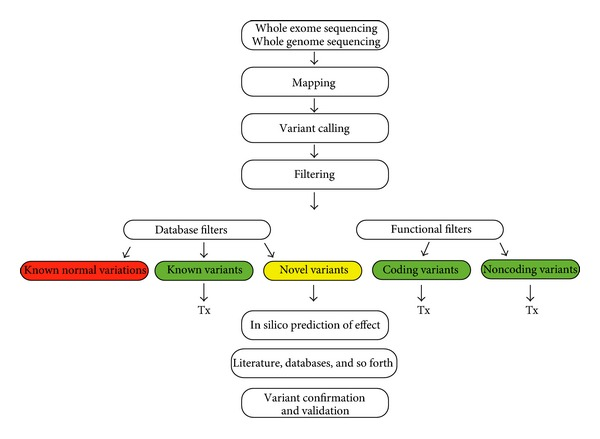
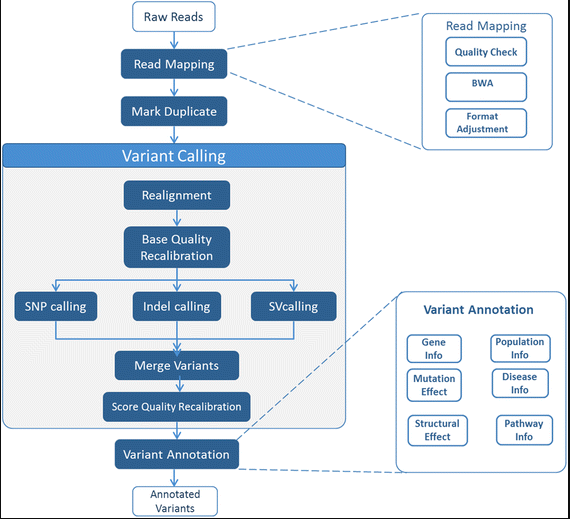

# 一个模拟项目

- 首先下载X,Y染色体的fasta序列，在UCSC上面下载即可。 
- 然后把X染色体构建bwa的索引
- 接着模拟一个Y染色体的测序数据，模拟的程序很简单,模拟Y染色体的测序片段（PE100，insert400） 
- 然后把模拟测序数据比对到X染色体的参考，统计一下比对结果。
- 最后对比对成功的bam文件进行找变异位点。

代码如下：

```
## 源代码方式安装 bwa-0.7.15 
## conda安装samtools
cd tmp/chrX_Y/hg19/
wget http://hgdownload.cse.ucsc.edu/goldenPath/hg19/chromosomes/chrX.fa.gz  
wget http://hgdownload.cse.ucsc.edu/goldenPath/hg19/chromosomes/chrY.fa.gz 
gunzip chrX.fa.gz
gunzip chrY.fa.gz
~/biosoft/bwa/bwa-0.7.15/bwa index chrX.fa
perl simulate.pl chrY.fa ## 这个perl脚本在 http://www.bio-info-trainee.com/wp-content/uploads/2015/10/tmp.png 
~/biosoft/bwa/bwa-0.7.15/bwa mem -t 5 -M chrX.fa read*.fa >read.sam
samtools view -bS read.sam >read.bam
samtools flagstat read.bam
samtools sort -@ 5 -o read.sorted.bam read.bam
samtools view -h -F4 -q 5 read.sorted.bam |samtools view -bS|samtools rmdup - read.filter.rmdup.bam
samtools index read.filter.rmdup.bam
samtools mpileup -ugf ~/tmp/chrX_Y/hg19/chrX.fa read.filter.rmdup.bam |bcftools call -vmO z -o read.bcftools.vcf.gz
## 把fa/bam/vcf 载入到 IGV 进行可视化，截图其中一个变异位点
## 参考 http://www.biotrainee.com/thread-696-1-1.html
```

# 变异寻找的流程

完整的流程可以很复杂：



仅仅是上游的变异寻找流程就可以很复杂：



来自于2017年发表于BMC Bioinformatics的文章 [MC-GenomeKey: a multicloud system for the detection and annotation of genomic variants](https://bmcbioinformatics.biomedcentral.com/articles/10.1186/s12859-016-1454-2)

# 一个实战项目

### ESCC-肿瘤空间异质性探究

> 肿瘤异质性包括**空间异质性**、**时间异质性**、解剖异质性、结构异质性、基因异质性和功能异质性等等

肿瘤异质性是恶性肿瘤的特征之一，是指肿瘤在生长过程中，经过多次分裂增殖，其子细胞呈现出分子生物学或基因方面的改变，从而使肿瘤的生长速度、侵袭能力、对药物的敏感性、预后等各方面产生差异。肿瘤异质性一直是肿瘤治疗的挑战之一，肿瘤内部**不同亚群的细胞**对药物敏感性的不同可能会导致治疗的失败。现在主流的探究肿瘤异质性的方法是：

- 对肿瘤病人的肿瘤组织进行不同时间点取样
- 对肿瘤病人的肿瘤组织不同部分分别取样

取样后测序可以是WES,WGS，或者靶向部分特殊基因进行高深度测序。数据分析的时候探究不同测序结果的somatic mutation的共有比例，或者部分突变的allele frequency的变化。

这样的研究已经有很多，包括不同时间点或者不同空间取样来分析肿瘤异质性的，比如：

> Marusyk A, Almendro V, Polyak K. Intra-tumour heterogeneity: a looking glass for cancer?[J]. Nature Reviews Cancer, 2012, 12(5): 323-334.
>
> Zhang J, Fujimoto J, Zhang J, et al. Intratumor heterogeneity in localized lung adenocarcinomas delineated by multiregion sequencing[J]. Science, 2014, 346(6206): 256-259.
>
> Shi Y J, Tsang J, Ni Y B, et al. Intratumoral Heterogeneity in Breast Cancer: A Comparison of Primary and Metastatic Breast Cancers[J]. Oncologist, 2017, 22(4).
>
> Hao J J, Lin D C, Dinh H Q, et al. Spatial intratumoral heterogeneity and temporal clonal evolution in esophageal squamous cell carcinoma[J]. Nature genetics, 2016, 48(12): 1500-1507.

下面就拿[Nature genetics, 2016的关于ESCC不同空间取样探究肿瘤异质性](https://www.ncbi.nlm.nih.gov/pubmed/27749841)来详细解读。

##  文章解读

食管癌，Esophageal squamous cell carcinoma (ESCC) ，作者选择了**13个ESCC病人的51处肿瘤组织**进行WES测序分析，同时也测了他们的正常组织做对照。**平均测序深度150X，测序策略都是150PE。**总共找到了涉及了1427个基因的1610个非沉默突变，还有568个沉默突变。本文主要关注点就是：spatial intratumoral heterogeneity (ITH) and temporal clonal evolutionary 

> *silent mutations（*沉默突变）：即同义突变，突变虽然替换了碱基，但氨基酸顺序未变，保持野生型的功能。

有趣的是其中两个病人用的是**BGI的CG测序平台**，而其余的都是用Agilent SureSelect Human All Exon v4 (51 Mb) kit 捕获外显子序列，用Illumina HiSeq 4000进行PE150的测序，当然，还是在BGI公司测的。

他们选择的分析流程是最经典的**BWA-MEM 比对到hg19**，然后走 GATK best practices得到每个测序样本的bam文件。至于找somatic mutation步骤，选取的是varscan，注释用的是ANNOVAR。对于得到肿瘤特异性的变异之后做的**高级分析**包括：

- Phylogenetic tree construction
- Cancer cell fraction analysis
- Identification of putative driver mutations
- Mutational signature analysis
- DNA methylation analysis 

甲基化数据(Illumina HumanMethylation450 BeadChip)都上传到了GEO里面，[GSE79366](http://www.ncbi.nlm.nih.gov/geo/query/acc.cgi?acc=GSE79366),  对应的NGS序列也在SRA数据库中 [SRP072112](http://www.ncbi.nlm.nih.gov/sra?term=SRP072112) ，我们可以获取到数据。我随便选了一个人的四个全外显子数据，测序策略都是PE150，SRA数据库的ID分别是:

```
ESCC13-T4	SRR3270888
ESCC13-T3	SRR3270887
ESCC13-T2	SRR3270886
ESCC13-T1	SRR3270885
ESCC13-N	SRR3270884
```

##  从SRA数据库下载并转换为fastq测序数据文件

把上面的描述文本存为文件**escc.sra.txt**下载脚本如下：

```shell
cat escc.sra.txt | cut -f 2|while read id
do echo $id
wget -c ftp://ftp-trace.ncbi.nlm.nih.gov/sra/sra-instant/reads/ByStudy/sra/SRP/SRP072/SRP072112/$id/$id.sra
done 
```

转换脚本如下:

```shell
cat escc.sra.txt | while read id
do
array=($id)
echo  ${array[1]}.sra  ${array[0]} 
~/biosoft/sratoolkit/sratoolkit.2.8.2-1-centos_linux64/bin/fastq-dump --gzip --split-3 -A \  
${array[0]}  ${array[1]}.sra 
done 
```

得到的sra和fastq文件如下：

```
5.7G Sep 19 17:24 SRR3270884.sra
7.7G Sep 19 17:18 SRR3270885.sra
6.8G Sep 19 16:16 SRR3270886.sra
5.7G Sep 19 15:59 SRR3270887.sra
6.0G Sep 19 15:50 SRR3270888.sra

3.9G Sep 20 10:38 ESCC13-N_1.fastq.gz
4.3G Sep 20 10:38 ESCC13-N_2.fastq.gz
5.3G Sep 20 11:32 ESCC13-T1_1.fastq.gz
5.9G Sep 20 11:32 ESCC13-T1_2.fastq.gz
4.6G Sep 20 06:44 ESCC13-T2_1.fastq.gz
5.1G Sep 20 06:44 ESCC13-T2_2.fastq.gz
3.9G Sep 20 03:30 ESCC13-T3_1.fastq.gz
4.4G Sep 20 03:30 ESCC13-T3_2.fastq.gz
4.1G Sep 20 00:42 ESCC13-T4_1.fastq.gz
4.5G Sep 20 00:42 ESCC13-T4_2.fastq.gz
```

大家看上面文件的日期，可以很明显的看到我下载sra文件，以及把sra文件用fastq-dump转为fastq文件所消耗的时间，基本上下载只需要15分钟，但是转换居然耗时3小时，所以并行很有必要哈。所以一晚上才转换了T2,T3,T4这3个样本，我嫌弃它太慢了，**就把T1和N两个样本并行了。**

简单的走一下fastqc+multiqc 看看数据质量，一般都会很不错的，这个数据也不例外。

```Shell
ls *.gz |xargs ~/biosoft/fastqc/FastQC/fastqc -o ./ -t 5 
```


##  然后走WES的标准SNP-calling流程

选用的是经典的GATK best practice的流程，**整个项目最后耗费空间约500G**，代码如下:

```shell
#!/bin/bash
#SBATCH --job-name			wes_tumor_human
#SBATCH --partition			FHS_NORMAL
#SBATCH --nodes				1
#SBATCH --tasks-per-node	5
#SBATCH --mem				40G 
#SBATCH --output			wes.%j.out
#SBATCH --error				wes.%j.err
#SBATCH --mail-type			FAIL
#SBATCH --mail-user			yb77613@umac.mo

module load java/1.8.0_91
GENOME=/home/jianmingzeng/reference/genome/human_g1k_v37/human_g1k_v37.fasta
INDEX=/home/jianmingzeng/reference/index/bwa/human_g1k_v37
GATK=/home/jianmingzeng/biosoft/GATK/GenomeAnalysisTK.jar
PICARD=/home/jianmingzeng/biosoft/picardtools/2.9.2/picard.jar

DBSNP=/home/jianmingzeng/annotation/variation/human/dbSNP/All_20160601.vcf.gz
SNP=/home/jianmingzeng/biosoft/GATK/resources/bundle/b37/1000G_phase1.snps.high_confidence.b37.vcf.gz
INDEL=/home/jianmingzeng/biosoft/GATK/resources/bundle/b37/Mills_and_1000G_gold_standard.indels.b37.vcf.gz

KG_SNP=/home/jianmingzeng/biosoft/GATK/resources/bundle/b37/1000G_phase1.snps.high_confidence.b37.vcf.gz
Mills_indels=/home/jianmingzeng/biosoft/GATK/resources/bundle/b37/Mills_and_1000G_gold_standard.indels.b37.vcf
KG_indels=/home/jianmingzeng/biosoft/GATK/resources/bundle/b37/1000G_phase1.indels.b37.vcf

TMPDIR=/home/jianmingzeng/tmp/software
## samtools and bwa are in the environment
## samtools Version: 1.3.1 (using htslib 1.3.1)
## bwa Version: 0.7.15-r1140


#arr=($1)
#fq1=${arr[0]}
#fq2=${arr[1]}
#sample=${arr[2]}

fq1=$1
fq2=$2
sample=$3


#####################################################
################ Step 1 : Alignment #################
#####################################################
start=$(date +%s.%N)
echo bwa `date`
bwa mem -t 5 -M  -R "@RG\tID:$sample\tSM:$sample\tLB:WES\tPL:Illumina" $INDEX $fq1 $fq2 1>$sample.sam 2>/dev/null 
echo bwa `date`
dur=$(echo "$(date +%s.%N) - $start" | bc)
printf "Execution time for BWA : %.6f seconds" $dur
echo 

#####################################################
################ Step 2: Sort and Index #############
#####################################################
start=$(date +%s.%N)
echo SortSam `date`
java -Djava.io.tmpdir=$TMPDIR    -Xmx40g -jar $PICARD SortSam SORT_ORDER=coordinate INPUT=$sample.sam OUTPUT=$sample.bam
samtools index $sample.bam
echo SortSam `date`
dur=$(echo "$(date +%s.%N) - $start" | bc)
printf "Execution time for SortSam : %.6f seconds" $dur
echo 
rm $sample.sam 

#####################################################
################ Step 3: Basic Statistics ###########
#####################################################
start=$(date +%s.%N)
echo stats `date`
samtools flagstat $sample.bam > ${sample}.alignment.flagstat
samtools stats  $sample.bam > ${sample}.alignment.stat
echo plot-bamstats -p ${sample}_QC  ${sample}.alignment.stat
echo stats `date`
dur=$(echo "$(date +%s.%N) - $start" | bc)
printf "Execution time for Basic Statistics : %.6f seconds" $dur
echo 

#####################################################
####### Step 4: multiple filtering for bam files ####
#####################################################


###MarkDuplicates###
start=$(date +%s.%N)
echo MarkDuplicates `date`
java -Djava.io.tmpdir=$TMPDIR    -Xmx40g -jar $PICARD MarkDuplicates \
INPUT=$sample.bam OUTPUT=${sample}_marked.bam METRICS_FILE=$sample.metrics
echo MarkDuplicates `date`
dur=$(echo "$(date +%s.%N) - $start" | bc)
printf "Execution time for MarkDuplicates : %.6f seconds" $dur
echo 
rm $sample.bam  

###FixMateInfo###
start=$(date +%s.%N)
echo FixMateInfo `date`
java -Djava.io.tmpdir=$TMPDIR    -Xmx40g -jar $PICARD FixMateInformation \
INPUT=${sample}_marked.bam OUTPUT=${sample}_marked_fixed.bam SO=coordinate
samtools index ${sample}_marked_fixed.bam
echo FixMateInfo `date`
dur=$(echo "$(date +%s.%N) - $start" | bc)
printf "Execution time for FixMateInfo  : %.6f seconds" $dur
echo 


rm ${sample}_marked.bam 

#####################################################
####### Step 5: gatk process bam files ##############
#####################################################


### SplitNCigar ###
start=$(date +%s.%N)
echo SplitNCigar `date`
java -Djava.io.tmpdir=$TMPDIR   -Xmx40g -jar $GATK -T SplitNCigarReads \
 -R $GENOME  -I ${sample}_marked_fixed.bam  -o ${sample}_marked_fixed_split.bam \
-rf ReassignOneMappingQuality -RMQF 255 -RMQT 60 -U ALLOW_N_CIGAR_READS 
#--fix_misencoded_quality_scores
## --fix_misencoded_quality_scores only if phred 64 
echo SplitNCigar `date`
dur=$(echo "$(date +%s.%N) - $start" | bc)
printf "Execution time for SplitNCigar : %.6f seconds" $dur
echo 

rm ${sample}_marked_fixed.bam 
# rm ${sample}.sam ${sample}.bam ${sample}_marked.bam ${sample}_marked_fixed.bam


###RealignerTargetCreator###
start=$(date +%s.%N)
echo RealignerTargetCreator `date`
java -Djava.io.tmpdir=$TMPDIR   -Xmx40g -jar $GATK -T RealignerTargetCreator \
-I ${sample}_marked_fixed_split.bam -R $GENOME -o ${sample}_target.intervals \
-known $Mills_indels -known $KG_indels -nt 5
echo RealignerTargetCreator `date`
dur=$(echo "$(date +%s.%N) - $start" | bc)
printf "Execution time for RealignerTargetCreator : %.6f seconds" $dur
echo 


###IndelRealigner###
start=$(date +%s.%N)
echo IndelRealigner `date`
java -Djava.io.tmpdir=$TMPDIR   -Xmx40g -jar $GATK -T IndelRealigner \
-I ${sample}_marked_fixed_split.bam  -R $GENOME -targetIntervals ${sample}_target.intervals \
-o ${sample}_realigned.bam -known $Mills_indels -known $KG_indels
echo IndelRealigner `date`
dur=$(echo "$(date +%s.%N) - $start" | bc)
printf "Execution time for IndelRealigner : %.6f seconds" $dur
echo 

rm ${sample}_marked_fixed_split.bam

###BaseRecalibrator###
start=$(date +%s.%N)
echo BaseRecalibrator `date`
java -Djava.io.tmpdir=$TMPDIR   -Xmx40g -jar $GATK -T BaseRecalibrator \
-I ${sample}_realigned.bam -R $GENOME -o ${sample}_temp.table -knownSites $DBSNP
echo BaseRecalibrator `date`
dur=$(echo "$(date +%s.%N) - $start" | bc)
printf "Execution time for BaseRecalibrator : %.6f seconds" $dur
echo 


###PrintReads###
start=$(date +%s.%N)
echo PrintReads `date`
java -Djava.io.tmpdir=$TMPDIR   -Xmx40g -jar $GATK -T PrintReads \
-R $GENOME -I ${sample}_realigned.bam -o ${sample}_recal.bam -BQSR ${sample}_temp.table
samtools index ${sample}_recal.bam
echo PrintReads `date`
dur=$(echo "$(date +%s.%N) - $start" | bc)
printf "Execution time for PrintReads : %.6f seconds" $dur
echo 

rm  ${sample}_realigned.bam
chmod uga=r   ${sample}_recal.bam 
 
#####################################################
############## Step 6: gatk call snp/indel##########
#####################################################

### 
start=$(date +%s.%N)
echo HaplotypeCaller `date`
java -Djava.io.tmpdir=$TMPDIR   -Xmx40g -jar $GATK -T HaplotypeCaller  \
-R $GENOME -I ${sample}_recal.bam --dbsnp $DBSNP  \
-stand_emit_conf 10 -o  ${sample}_raw.snps.indels.vcf
echo HaplotypeCaller `date`
dur=$(echo "$(date +%s.%N) - $start" | bc)
printf "Execution time for HaplotypeCaller : %.6f seconds" $dur
echo 


java -Djava.io.tmpdir=$TMPDIR   -Xmx40g -jar $GATK -T SelectVariants  -R $GENOME  \
-selectType SNP \
-V ${sample}_raw.snps.indels.vcf -o ${sample}_raw_snps.vcf

java -Djava.io.tmpdir=$TMPDIR   -Xmx40g -jar $GATK -T SelectVariants  -R $GENOME \
-selectType INDEL  \
-V ${sample}_raw.snps.indels.vcf   -o ${sample}_raw_indels.vcf


## 
:'
'
## for SNP

java -Djava.io.tmpdir=$TMPDIR   -Xmx40g -jar $GATK -T VariantFiltration -R $GENOME  \
--filterExpression "QD < 2.0 || FS > 60.0 || MQ < 40.0 || MQRankSum < -12.5 || ReadPosRankSum < -8.0"  \
--filterName "my_snp_filter" \
-V ${sample}_raw_snps.vcf  -o ${sample}_filtered_snps.vcf   

java -Djava.io.tmpdir=$TMPDIR   -Xmx40g -jar $GATK -T SelectVariants -R $GENOME  \
--excludeFiltered \
-V ${sample}_filtered_snps.vcf  -o  ${sample}_filtered_PASS.snps.vcf


java -Djava.io.tmpdir=$TMPDIR   -Xmx40g -jar $GATK -T VariantEval -R $GENOME  \
-eval ${sample}_filtered_PASS.snps.vcf -o  ${sample}_filtered_PASS.snps.vcf.eval


## for  INDEL


java -Djava.io.tmpdir=$TMPDIR   -Xmx40g -jar $GATK -T VariantFiltration -R $GENOME  \
--filterExpression "QD < 2.0 || FS > 200.0 || ReadPosRankSum < -20.0"  \
--filterName "my_indel_filter" \
-V ${sample}_raw_indels.vcf  -o ${sample}_filtered_indels.vcf   

java -Djava.io.tmpdir=$TMPDIR   -Xmx40g -jar $GATK -T SelectVariants -R $GENOME  \
--excludeFiltered \
-V ${sample}_filtered_indels.vcf  -o  ${sample}_filtered_PASS.indels.vcf

java -Djava.io.tmpdir=$TMPDIR   -Xmx40g -jar $GATK -T VariantEval -R $GENOME  \
-eval ${sample}_filtered_PASS.indels.vcf -o  ${sample}_filtered_PASS.indels.vcf.eval
```

把上面的代码保存为**human_tumor_wes.sh** 文件，运行即可：

```Shell
bash human_tumor_wes.sh ESCC13-T4_1.fastq.gz ESCC13-T4_2.fastq.gz ESCC13-T4
bash human_tumor_wes.sh ESCC13-T3_1.fastq.gz ESCC13-T3_2.fastq.gz ESCC13-T3
bash human_tumor_wes.sh ESCC13-T2_1.fastq.gz ESCC13-T2_2.fastq.gz ESCC13-T2
bash human_tumor_wes.sh ESCC13-N_1.fastq.gz ESCC13-N_2.fastq.gz ESCC13-N
bash human_tumor_wes.sh ESCC13-T1_1.fastq.gz ESCC13-T1_2.fastq.gz ESCC13-T1
```

比对成功后得到的sam/bam文件如下；

```
38G Sep 20 15:15 ESCC13-N.sam
52G Sep 20 16:35 ESCC13-T1.sam
43G Sep 20 11:34 ESCC13-T2.sam
38G Sep 20 10:39 ESCC13-T3.sam
40G Sep 20 12:34 ESCC13-T4.sam
## 本来只需要一天就可以完成的，因为中间不小心误删了，所以又花费了一天重新运行。
17G Sep 22 00:01 ESCC13-N_recal.bam
22G Sep 22 02:09 ESCC13-T1_recal.bam
21G Sep 22 01:59 ESCC13-T2_recal.bam
16G Sep 21 23:29 ESCC13-T3_recal.bam
17G Sep 22 00:32 ESCC13-T4_recal.bam
```

用GATK做Snp-calling结束后得到的**germline的vcf**如下：

```
18M Sep 22 05:14 ESCC13-N_filtered_indels.vcf
 15M Sep 22 05:14 ESCC13-N_filtered_PASS.indels.vcf
106M Sep 22 05:13 ESCC13-N_filtered_PASS.snps.vcf
148M Sep 22 05:13 ESCC13-N_filtered_snps.vcf
 17M Sep 22 05:11 ESCC13-N_raw_indels.vcf
163M Sep 22 05:10 ESCC13-N_raw.snps.indels.vcf
146M Sep 22 05:11 ESCC13-N_raw_snps.vcf
261M Sep 22 08:45 ESCC13-T1_raw.snps.indels.vcf
 25M Sep 22 08:27 ESCC13-T2_filtered_indels.vcf
 21M Sep 22 08:27 ESCC13-T2_filtered_PASS.indels.vcf
166M Sep 22 08:26 ESCC13-T2_filtered_PASS.snps.vcf
220M Sep 22 08:25 ESCC13-T2_filtered_snps.vcf
 24M Sep 22 08:23 ESCC13-T2_raw_indels.vcf
240M Sep 22 08:22 ESCC13-T2_raw.snps.indels.vcf
217M Sep 22 08:23 ESCC13-T2_raw_snps.vcf
 19M Sep 22 05:03 ESCC13-T3_filtered_indels.vcf
 16M Sep 22 05:04 ESCC13-T3_filtered_PASS.indels.vcf
114M Sep 22 05:02 ESCC13-T3_filtered_PASS.snps.vcf
153M Sep 22 05:02 ESCC13-T3_filtered_snps.vcf
 18M Sep 22 05:01 ESCC13-T3_raw_indels.vcf
169M Sep 22 04:59 ESCC13-T3_raw.snps.indels.vcf
151M Sep 22 05:00 ESCC13-T3_raw_snps.vcf
 17M Sep 22 06:02 ESCC13-T4_filtered_indels.vcf
 14M Sep 22 06:03 ESCC13-T4_filtered_PASS.indels.vcf
101M Sep 22 06:01 ESCC13-T4_filtered_PASS.snps.vcf
142M Sep 22 06:01 ESCC13-T4_filtered_snps.vcf
 17M Sep 22 06:00 ESCC13-T4_raw_indels.vcf
156M Sep 22 05:59 ESCC13-T4_raw.snps.indels.vcf
140M Sep 22 05:59 ESCC13-T4_raw_snps.vcf
```

可以看到同一个病人的不同部位的测试数据从VCF文件大小是一致，无论是正常组织还是不同部位的肿瘤组织，因为这个只取决于测序策略，既然都是同样试剂盒的WES，那么就应该数量上一致。这些vcf里面的变异位点还需要进行简单的过滤，或者只提取外显子区域的变异位点。

消耗时间如下(单位/秒)；

|                        | ESCC13-T4   | ESCC13-T3   | ESCC13-T2   | ESCC13-N    | ESCC13-T1   |
| ---------------------- | ----------- | ----------- | ----------- | ----------- | ----------- |
| BWA                    | 15752.17897 | 8775.46665  | 12104.84719 | 12402.53776 | 17182.14944 |
| SortSam                | 3476.380327 | 3144.782829 | 3579.532608 | 3108.949776 | 4549.026435 |
| Basic                  | 805.272211  | 742.339223  | 868.472009  | 768.538827  | 967.358854  |
| MarkDuplicates         | 3641.093869 | 3894.738255 | 3908.686074 | 4086.0576   | 4682.282901 |
| FixMateInfo            | 3569.084078 | 3469.443716 | 3619.961404 | 4062.248132 | 4239.373038 |
| SplitNCigar            | 3001.644476 | 2340.691719 | 2669.063307 | 3126.101099 | 2988.452751 |
| RealignerTargetCreator | 1509.192067 | 971.168054  | 1079.901355 | 971.042629  | 1535.630384 |
| IndelRealigner         | 4790.518355 | 3124.91869  | 4505.609599 | 3935.274018 | 4531.344232 |
| BaseRecalibrator       | 6489.661528 | 5902.280588 | 7462.998495 | 6298.388474 | 7866.333404 |
| PrintReads             | 12270.10088 | 11476.74606 | 12926.89967 | 12941.7903  | 15786.03929 |
| HaplotypeCaller        | 19616.85794 | 18955.83296 | 23557.36776 | 19791.62247 | 23651.3952  |

因为每个样本的测序数据量差不多，所有时间上也差不了多少，每天样本都是独立并行的， 运行完这个流程，不超过24小时。其中用GATK对每个样本找变异位点是最耗费时间的一步，需要7~9个小时。

外显子的bam文件可以进行简单质控，可以自己写代码探究想探究的内容，代码如下:

```Shell
cut -f 1 escc.sra.txt|while read sample;
do
## 这里对bedtools的版本有要求，bedtools2-2.19.1 这个版本可以，但是 bedtools v2.25.0 却不行
bedtools coverage  -hist   -abam ${sample}_recal.bam  \
-b ~/annotation/CCDS/human/hg19_exon.bed  |grep '^all'>${sample}.exome.coverage.hist.txt
## 后面的几个质控，代码是我自己写的，所以大家可以不运行。
perl ~/scripts/calc_coverage_depth.pl ~/annotation/CCDS/human/CCDS.20110907.txt ${sample}_recal.bam
done
```

QC结果是：

| 区域         | 覆盖度    | 平均测序深度      |
| ---------- | ------ | ----------- |
| exon       | 96.76% | 86.50434677 |
| exon+50bp  | 94.13% | 57.65703289 |
| exon+100bp | 84.92% | 40.18870378 |
| exon+150bp | 75.89% | 27.55130397 |
|            |        |             |
| exon       | 97.10% | 90.60636401 |
| exon+50bp  | 94.78% | 61.00252203 |
| exon+100bp | 86.38% | 43.11063934 |
| exon+150bp | 78.68% | 29.38888981 |
|            |        |             |
| exon       | 96.71% | 79.13011757 |
| exon+50bp  | 93.66% | 54.16393067 |
| exon+100bp | 84.74% | 38.18401794 |
| exon+150bp | 76.44% | 26.01125658 |
|            |        |             |
| exon       | 97.04% | 88.4436236  |
| exon+50bp  | 94.70% | 58.70923125 |
| exon+100bp | 85.69% | 40.8687831  |
| exon+150bp | 76.72% | 27.92466774 |

可以看到所有样本的CCDS记录的EXON的覆盖度都非常好，几乎接近100%，说明这款芯片的捕获效率比较好。而且即使扩展到外显子侧翼区域的上下游150bpf范围内，覆盖度还有75%。外显子区域的测序深度高达80X左右，也是非常好的测序数据，足够做大部分的肿瘤数据分析了。

##  接着走走somatic mutation calling流程

因为是配对数据，还可以走somatic mutation calling流程

```shell
reference=/home/jianmingzeng/reference/genome/human_g1k_v37/human_g1k_v37.fasta
GATK=/home/jianmingzeng/biosoft/GATK/GenomeAnalysisTK.jar
PICARD=/home/jianmingzeng/biosoft/picardtools/2.9.2/picard.jar
DBSNP=/home/jianmingzeng/annotation/variation/human/dbSNP/All_20160601.vcf.gz
SNP=/home/jianmingzeng/biosoft/GATK/resources/bundle/b37/1000G_phase1.snps.high_confidence.b37.vcf.gz
INDEL=/home/jianmingzeng/biosoft/GATK/resources/bundle/b37/Mills_and_1000G_gold_standard.indels.b37.vcf.gz

TMPDIR=/home/jianmingzeng/tmp/software
normal_bam=$1
tumor_bam=$2
sample=$3

#####################################################
################### Step : Run VarScan #############
#####################################################
start=$(date +%s.%N)
echo VarScan `date`
normal_pileup="samtools mpileup -q 1 -f $reference $normal_bam";
tumor_pileup="samtools mpileup -q 1 -f $reference $tumor_bam";
# Next, issue a system call that pipes input from these commands into VarScan :
java -Djava.io.tmpdir=$TMPDIR   -Xmx40g  -jar ~/biosoft/VarScan/VarScan.v2.3.9.jar \
somatic <($normal_pileup) <($tumor_pileup) ${sample}_varscan
java -jar ~/biosoft/VarScan/VarScan.v2.3.9.jar processSomatic ${sample}_varscan.snp
echo VarScan `date`
dur=$(echo "$(date +%s.%N) - $start" | bc)
printf "Execution time for VarScan : %.6f seconds" $dur
echo 
#####################################################
################### Step : Run Mutect2 #############
#####################################################
start=$(date +%s.%N)
echo Mutect2 `date`
java -Djava.io.tmpdir=$TMPDIR   -Xmx25g -jar $GATK  -T MuTect2 \
-R $reference -I:tumor $tumor_bam  -I:normal $normal_bam \
--dbsnp  $DBSNP   -o ${sample}-mutect2.vcf
echo Mutect2 `date`
dur=$(echo "$(date +%s.%N) - $start" | bc)
printf "Execution time for Mutect2 : %.6f seconds" $dur
echo 
#####################################################
################### Step : Run Muse#################
#####################################################
start=$(date +%s.%N)
echo Muse `date`
~/biosoft/muse/muse call -O $sample -f $reference $tumor_bam $normal_bam
~/biosoft/muse/muse sump -I ${sample}.MuSE.txt -E -O ${sample}_muse.vcf -D $DBSNP 
echo Muse `date`
dur=$(echo "$(date +%s.%N) - $start" | bc)
printf "Execution time for Muse : %.6f seconds" $dur
echo 

```

把上面的脚本保存到**somatic.wes.sh**文件里面，然后运行，如下：

```
bash somatic.wes.sh ESCC13-N_recal.bam ESCC13-T1_recal.bam T1
bash somatic.wes.sh ESCC13-N_recal.bam ESCC13-T2_recal.bam T2
bash somatic.wes.sh ESCC13-N_recal.bam ESCC13-T3_recal.bam T3
bash somatic.wes.sh ESCC13-N_recal.bam ESCC13-T4_recal.bam T4
```

这些软件在这些样本运行耗时如下：

```
Execution time for Mutect2 : 138060.729452 seconds
Execution time for Muse : 7837.170425 seconds
Execution time for Mutect2 : 136501.226588 seconds
Execution time for Muse : 7671.200814 seconds
Execution time for Mutect2 : 89365.138741 seconds
Execution time for Muse : 8139.333510 seconds
Execution time for Mutect2 : 82843.830976 seconds
Execution time for Muse : 8192.826623 seconds
```

可以看到**mutect这个算法巨慢**，接近30个小时，而varscan和muse都很快的，基本上两三个小时就搞定。所以很多商业公司为mutect开发加速平台。 

得到的变异位点个数如下:

```
wc -l *.Somatic.hc
  1140 T1_varscan.snp.Somatic.hc
  1338 T2_varscan.snp.Somatic.hc
   787 T3_varscan.snp.Somatic.hc
   683 T4_varscan.snp.Somatic.hc
  
for i in  *mutect2.vcf ;do (echo -n $i;grep -w "PASS"  $i|wc);done
T1-mutect2.vcf    968   10648  204541
T2-mutect2.vcf    919   10109  192142
T3-mutect2.vcf    809    8899  170103
T4-mutect2.vcf   1004   11044  218558 

for i in  *muse.vcf ;do (echo -n $i;grep -w "PASS"  $i|wc);done
T1_muse.vcf    860    9455   77889
T2_muse.vcf    916   10071   82766
T3_muse.vcf    642    7057   57970
T4_muse.vcf    246    2701   22268
```

可以看到这些不同的软件找到的somatic mutation位点是差不多的，唯一例外的是T4这个样本，被**muse这个软件**找到的位点数量太少了一点，需要仔细探究为什么，而且需要具体去比较位点。

本文作者只做了varscanfix，而且**自定义了参数**，如下：

- Reference genome positions covered by at least 10 reads in the normal sample and 14 reads in tumor samples were considered for variant calling. 
- Variants with VAF less than 0.07 were discarded. 
- Raw somatic variants were filtered using the VarScan 'processSomatic' command with arguments --min-tumor-freq 0.07, --max-normal-freq 0.02 and --p-value set to 0.05.

最后得到的somatic还使用了自己的perl脚本[fpFilter](https://github.com/ckandoth/variant-filter)来过滤那些假阳性的somatic mutation。最后得到的位点用ANNOVAR进行注释，还去除了那些出现在dbSNP135数据库的常见位点。还用了ClinVar和COSMIC注释了疾病相关信息。

##  高级分析

这些高级分析都是基于上一步找到的所有测序样本的高质量的somatic mutation，所以务必保证吃透理解了前面的原理，细节。后续高级分析并不系统和确定，我只是根据本文，稍微模仿练习一下。

###  用PHYLIP软件构建进化树

效果图如下：


那些VAF低于0.02的突变位点，还有那些少于3条reads的就认为是没有突变，构建所有的共有位点在每个病人的4个肿瘤样本里面是否突变的0/1矩阵。构建进化树的算法主要分为两类：独立元素法（discrete character methods）和距离依靠法（distance methods）。本文作者选用**独立元素法**对得到的0/1矩阵用PHYLIP (Phylogeny Inference Package) 软件来构建进化树。

这里我也像作者一样，选取varscan的结果来进行下游分析，因为时间关系，我就没有保证自己的varscan参数与作者文章中的一致，也没有进行一系列过滤。

```R
options(stringsAsFactors = F)
T1_varscan=read.table('T1_varscan.snp.Somatic.hc',sep="\t",header = T)
T2_varscan=read.table('T2_varscan.snp.Somatic.hc',sep="\t",header = T)
T3_varscan=read.table('T3_varscan.snp.Somatic.hc',sep="\t",header = T)
T4_varscan=read.table('T4_varscan.snp.Somatic.hc',sep="\t",header = T)
 

T1=apply(T1_varscan[,1:2],1,function(x) paste0(x,collapse = ':'))
T2=apply(T2_varscan[,1:2],1,function(x) paste0(x,collapse = ':'))
T3=apply(T3_varscan[,1:2],1,function(x) paste0(x,collapse = ':'))
T4=apply(T4_varscan[,1:2],1,function(x) paste0(x,collapse = ':'))
all_pos=unique(c(T1,T2,T3,T4))

library(VennDiagram)
venn.diagram(x = list(T1 = T1,T2 = T2,T3 = T3,T4 = T4), 
             filename = "Venn_varscan.png",imagetype = 'png')

dat <- data.frame(T1=as.numeric(all_pos %in% T1 ),
                  T2=as.numeric(all_pos %in% T2 ),
                  T3=as.numeric(all_pos %in% T3 ),
                  T4=as.numeric(all_pos %in% T4 )
                  )
plot(hclust(dist(t(dat))))
         
         
library(ape)
arbol<-nj(dist(t(dat)))
plot(arbol,type="unrooted")


```

同一个病人的肿瘤的4个不同部位取样分别测序，分析得到的somatic mutation 重合性不怎么样，韦恩图如下：


而且根据他们共有mutation的情况来画进化树如下：


跟作者也不一样，可能是因为somatic mutation没有进行细致的过滤挑选，而且也没有选择PHYLIP软件的问题。而且我觉得直接根据突变与否的信息来做进化树其实并不是最佳选择，应该考虑到**alle frequency**的信息。

或许我应该把每个样本的3个软件找到的somatic mutation取交集，这样得到的somatic mutation更严格，而且还可以只保留外显子区域的，不过这些探索就很个性化了，等我真正有需求了再去玩玩。

###  用ABSOLUTE软件来判定肿瘤纯度

结合somatic mutation的VAF值和**拷贝数变异**结果，用ABSOLUTE软件来计算每个mutation位点的CCF。

值得注意的是本文中WES数据的**拷贝数变异**是通过GATK(v4)的ReCapSeg命令来计算的，而且还利用到了自己实验室的一系列正常对照的数据。

###  寻找驱动突变

###  计算 mutation signature

用的是deconstructSigsz这个R包，把自己的signature分解对应到COSMIC的30个signature即可。


##  需要安装的软件

软件太多了，我就不一一列出具体代码了，还有很多需要下载的参考基因组，变异数据库也是以前直播基因组的时候已经反复提到过，也不赘述啦。

```shell
conda install -c bioconda bedtools
conda install -c bioconda bwa
conda install -c bioconda samtools

cd ~/biosoft
mkdir sratoolkit &&  cd sratoolkit
wget https://ftp-trace.ncbi.nlm.nih.gov/sra/sdk/current/sratoolkit.current-centos_linux64.tar.gz
tar zxvf sratoolkit.current-centos_linux64.tar.gz
~/biosoft/sratoolkit/sratoolkit.2.8.2-1-centos_linux64/bin/fastdump -h
## https://sourceforge.net/projects/picard/
## https://github.com/broadinstitute/picard
cd ~/biosoft
mkdir picardtools &&  cd picardtools
wget http://ncu.dl.sourceforge.net/project/picard/picard-tools/1.119/picard-tools-1.119.zip
unzip picard-tools-1.119.zip
mkdir 2.9.2 && cd 2.9.2 
wget https://github.com/broadinstitute/picard/releases/download/2.9.2/picard.jar


cd ~/biosoft
## https://sourceforge.net/projects/varscan/files/
## http://varscan.sourceforge.net/index.html
mkdir VarScan  &&  cd VarScan  
wget https://sourceforge.net/projects/varscan/files/VarScan.v2.3.9.jar 

cd ~/biosoft
mkdir SnpEff &&  cd SnpEff
##	http://snpeff.sourceforge.net/
##	http://snpeff.sourceforge.net/SnpSift.html 
##	http://snpeff.sourceforge.net/SnpEff_manual.html
wget http://sourceforge.net/projects/snpeff/files/snpEff_latest_core.zip 
## java -jar snpEff.jar download GRCh37.75
## java -Xmx4G -jar snpEff.jar -i vcf -o vcf GRCh37.75 example.vcf > example_snpeff.vcf
unzip snpEff_latest_core.zip
```


